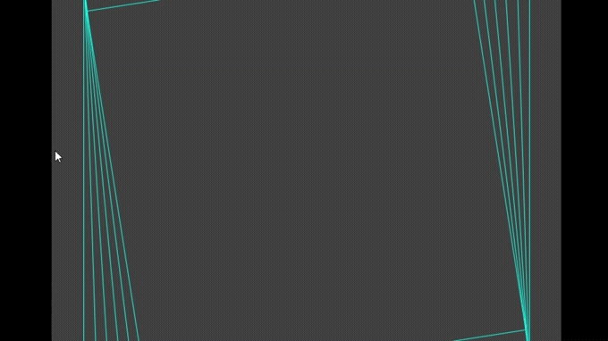
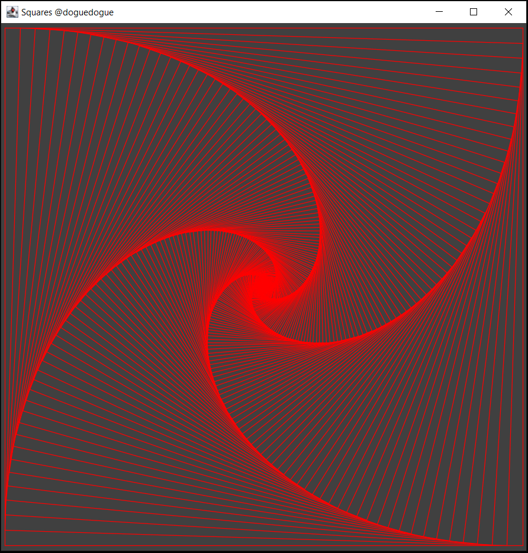

# Squares 🟦

Lo hice en la universidad como un applet (bazzinga) y ahora le doy vida nuevamente como una animación.

**Compilar**

```
mkdir bin
javac -d "bin" src\com\doguedogue\squares\*.java
```

**Windows**

```
java -cp bin/;. com.doguedogue.squares.AppSquares
```

**Linux**

```
java -cp bin/:. com.doguedogue.squares.AppSquares
```





